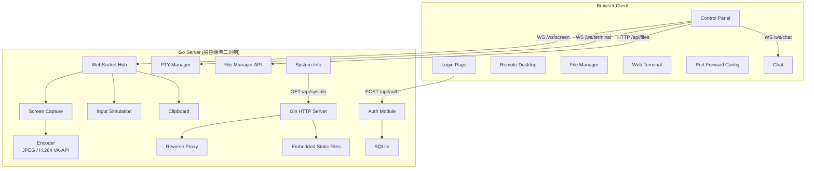
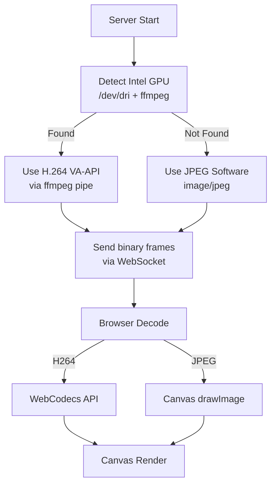

# LocalCtrl - Web 远程桌面控制工具

## 架构



## 技术栈

**后端 (Go)**

- HTTP 框架: `gin`
- WebSocket: `gorilla/websocket`
- 屏幕捕获: `kbinani/screenshot`
- 输入模拟: `go-vgo/robotgo`
- PTY: `creack/pty` (Linux/macOS), `UserEnv + ConPTY` (Windows)
- 数据库: `glebarez/go-sqlite` (纯 Go)
- 认证: `golang-jwt/jwt` + `bcrypt`
- TLS: `crypto/tls` + `crypto/x509` (自动生成自签名证书)
- 剪贴板: `atotto/clipboard`
- 系统信息: `shirou/gopsutil`
- 反向代理: 标准库 `net/http/httputil`
- 硬件编码: 检测到 ffmpeg 时调用 `ffmpeg` 子进程 (VA-API/QSV H.264)
- 前端嵌入: Go `embed` 包

**前端 (React)**

- Vite + TypeScript + Tailwind CSS
- 终端: `xterm.js` + `xterm-addon-fit`
- 路由: React Router
- 国际化: `react-i18next` (中/英双语)
- 主题: 跟随系统深浅色 + 手动切换 (Tailwind dark mode)
- 屏幕渲染: Canvas API
- H.264 解码: WebCodecs API (有硬编码时)
- 文件管理: 自定义组件 (树形浏览 + 拖拽上传)

## 项目结构

```
localctrl/
├── backend/
│   ├── main.go
│   ├── go.mod
│   ├── embed.go                  # //go:embed frontend/dist
│   ├── config/
│   │   └── config.go
│   ├── auth/
│   │   ├── handler.go
│   │   ├── jwt.go
│   │   └── store.go
│   ├── capture/
│   │   ├── screen.go
│   │   ├── encoder_jpeg.go
│   │   └── encoder_h264.go
│   ├── input/
│   │   └── input.go
│   ├── terminal/
│   │   └── pty.go
│   ├── filemanager/
│   │   └── handler.go
│   ├── proxy/
│   │   ├── handler.go
│   │   └── proxy.go
│   ├── chat/
│   │   └── chat.go
│   ├── clipboard/
│   │   └── clipboard.go
│   ├── sysinfo/
│   │   └── info.go
│   ├── ws/
│   │   ├── hub.go
│   │   ├── client.go
│   │   └── protocol.go
│   └── server/
│       └── server.go
├── frontend/
│   ├── package.json
│   ├── vite.config.ts
│   ├── index.html
│   └── src/
│       ├── main.tsx
│       ├── App.tsx
│       ├── pages/
│       │   ├── Login.tsx
│       │   └── Panel.tsx
│       ├── components/
│       │   ├── Sidebar.tsx
│       │   ├── DeviceInfo.tsx
│       │   ├── RemoteDesktop.tsx
│       │   ├── DesktopToolbar.tsx
│       │   ├── FileManager.tsx
│       │   ├── Terminal.tsx
│       │   ├── PortForward.tsx
│       │   ├── Chat.tsx
│       │   └── StatusBar.tsx
│       ├── hooks/
│       │   ├── useWebSocket.ts
│       │   └── useAuth.ts
│       ├── i18n/
│       │   └── index.ts
│       └── types/
│           └── protocol.ts
└── .gitignore
```

## 前端页面设计

**登录页**: 两个 Tab 切换 -- "快速连接"(输入访问密码) / "账号登录"(用户名+密码, 含注册链接)。支持中英文切换。

**控制面板**: 左侧边栏导航 + 右侧内容区

- 侧边栏: 设备名称 + 图标按钮 (桌面 / 文件 / 终端 / 端口 / 聊天 / 设置)
- 底部状态栏: 连接状态、带宽、延迟、帧率
- 主题: 跟随系统深浅色，可手动切换
- 国际化: 中英双语，设置中切换
- 响应式: 适配桌面/平板/手机，移动端侧边栏折叠为底部导航或汉堡菜单，远程桌面支持触屏手势（捏合缩放、拖拽平移）

## 服务启动行为

- 默认监听端口: **2001** (HTTPS)
- 首次启动读取配置文件 `config.yaml`，不存在则自动生成默认配置（含随机密码和默认用户）并保存，然后正常启动
- 自动生成的默认配置包含：随机访问密码、默认管理员账号（admin + 随机密码），启动时打印到终端
- 自动生成自签名 TLS 证书 (存储在 `~/.localctrl/cert.pem` + `key.pem`)，也可在配置文件中指定自定义证书路径
- 配置文件示例 (`~/.localctrl/config.yaml`):

```yaml
port: 2001
password: "auto-generated-random"
jwt_secret: "auto-generated"
default_user:
  username: "admin"
  password: "auto-generated-random"
tls:
  cert: ""
  key: ""
```

**远程桌面**: Canvas 全区域渲染, 浮动工具栏含:

- 显示器切换按钮 (多显示器时显示)
- 画质/帧率滑块
- 特殊按键 (Ctrl+Alt+Del, Win, PrintScreen 等)
- 全屏按钮
- 控制权状态 (查看/控制 切换)

## 视频编码策略



- 默认: JPEG 编码 (纯 Go, 零外部依赖)
- 可选: H.264 VA-API/QSV 编码 (需 ffmpeg 在 PATH, 自动检测 Intel GPU)
- 帧率: 5-30fps 可调, 默认 20fps
- JPEG 质量: 20%-95% 可调, 默认 60%

## WebSocket 协议

主连接 `WS /ws/screen` (认证后):

- Binary 消息: 屏幕帧数据 (JPEG 或 H.264 NAL)
- JSON 消息类型: `mouse_event`, `keyboard_event`, `screen_info`, `monitor_list`, `monitor_switch`, `config_update`, `control_request`, `control_grant`, `clipboard_sync`, `stats`

独立连接:

- `WS /ws/terminal/:id` -- 每个终端会话独立 WebSocket, 传输 PTY I/O
- `WS /ws/chat` -- 聊天消息

## 端口转发 (反向代理)

- Web 面板配置规则: 路径前缀 -> 目标地址
- 示例: `/proxy/app1/` -> `http://localhost:3000`
- 存储在 SQLite, 动态加载
- 使用 `httputil.ReverseProxy`, 支持 HTTP + WebSocket 代理

## API 端点汇总

- `POST /api/auth/login` -- 密码或账号登录
- `POST /api/auth/register` -- 注册账号
- `GET  /api/sysinfo` -- 设备信息
- `GET  /api/files?path=` -- 列出目录
- `POST /api/files/mkdir` -- 创建目录
- `POST /api/files/delete` -- 删除
- `POST /api/files/rename` -- 重命名
- `POST /api/files/move` -- 移动
- `POST /api/files/upload?path=` -- 上传文件
- `GET  /api/files/download?path=` -- 下载文件
- `GET  /api/proxy/rules` -- 获取代理规则
- `POST /api/proxy/rules` -- 添加规则
- `DELETE /api/proxy/rules/:id` -- 删除规则
- `WS   /ws/screen` -- 屏幕流 + 控制
- `WS   /ws/terminal/:id` -- 终端会话
- `WS   /ws/chat` -- 聊天
- `/proxy/*` -- 反向代理路径

---

## 开发进度

### 已完成

- [x] 初始化项目: Go module + React Vite + Tailwind + .gitignore
- [x] 定义 WebSocket 协议消息类型 (Go struct + TypeScript types)
- [x] 后端配置模块: 端口(默认2001)/密码/JWT secret/编码器/TLS 配置文件
- [x] 内置 TLS: 自动生成自签名证书, 默认 HTTPS 服务
- [x] 认证系统: SQLite 用户存储 + JWT + 密码认证 + 账号注册登录 handler
- [x] 系统信息模块: hostname/OS/CPU/RAM/GPU/Network 采集
- [x] 屏幕捕获: 跨平台截屏 + 多显示器枚举 + JPEG 编码器
- [x] H.264 硬件编码: ffmpeg 管道 + VA-API/QSV 自动检测 + fallback
- [x] 输入模拟: 鼠标(移动/点击/滚轮) + 键盘(按键/释放) + 特殊键
- [x] WebSocket Hub: 连接管理 + 多查看单控制 + 屏幕推流 + 控制权切换
- [x] 剪贴板同步: 读写系统剪贴板 + WebSocket 双向同步
- [x] PTY 终端: 创建/销毁 PTY + WebSocket 双向 IO + 窗口大小调整
- [x] 文件管理器: REST API (list/mkdir/delete/rename/move/upload/download)
- [x] 端口转发: 代理规则 CRUD + httputil.ReverseProxy 动态路由
- [x] 聊天功能: WebSocket 消息收发

### 进行中

- [ ] HTTP 服务整合: gin 路由 + JWT 中间件 + embed 静态文件
  - [x] server/server.go (路由注册 + 中间件 + WS handlers)
  - [x] server/tls.go (自签名证书生成)
  - [ ] main.go (入口)
  - [ ] embed.go (嵌入前端静态文件)
  - [ ] go.mod 补充直接依赖
  - [ ] server.go serveStaticFiles 改为服务嵌入 FS

### 待完成

- [ ] 前端脚手架: Vite + React + TS + Tailwind + Router + xterm.js + i18n(中英双语)
  - [x] package.json
  - [x] vite.config.ts
  - [x] index.html
  - [x] src/main.tsx
  - [x] src/App.tsx
  - [x] src/index.css
  - [x] src/hooks/useAuth.ts
  - [x] src/hooks/useWebSocket.ts
  - [x] src/types/protocol.ts
  - [x] src/i18n/index.ts
- [ ] 前端登录页: 快速连接(密码) + 账号登录/注册
  - [ ] src/pages/Login.tsx
- [ ] 前端主题: 跟随系统深浅色 + 手动切换支持
- [ ] 前端控制面板: 侧边栏布局 + 设备信息 + 状态栏(带宽/延迟/帧率)
  - [ ] src/pages/Panel.tsx
  - [ ] src/components/Sidebar.tsx
  - [ ] src/components/DeviceInfo.tsx
  - [ ] src/components/StatusBar.tsx
- [ ] 前端远程桌面: Canvas 渲染 + 鼠标键盘捕获 + WebCodecs H.264 解码 + 浮动工具栏
  - [ ] src/components/RemoteDesktop.tsx
  - [ ] src/components/DesktopToolbar.tsx
- [ ] 前端文件管理器: 目录浏览 + 文件操作 + 拖拽上传 + 下载
  - [ ] src/components/FileManager.tsx
- [ ] 前端终端: xterm.js + WebSocket + 多标签页
  - [ ] src/components/Terminal.tsx
- [ ] 前端端口转发: 规则列表 + 添加/删除
  - [ ] src/components/PortForward.tsx
- [ ] 前端聊天: 消息列表 + 输入发送
  - [ ] src/components/Chat.tsx
- [ ] 前后端集成: 构建前端 embed 进 Go + 端到端测试
